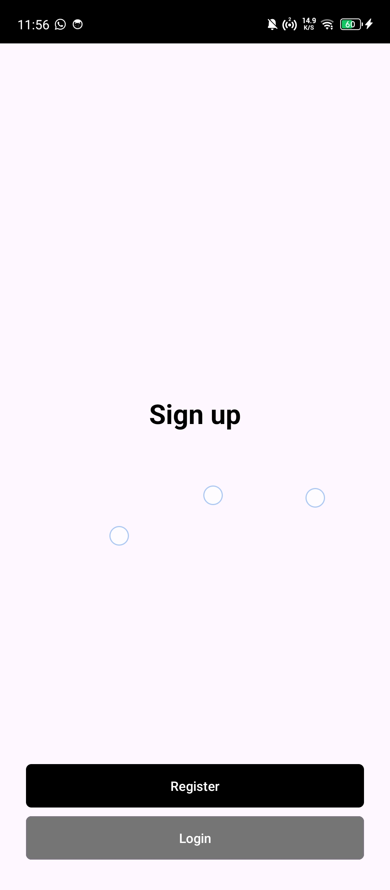
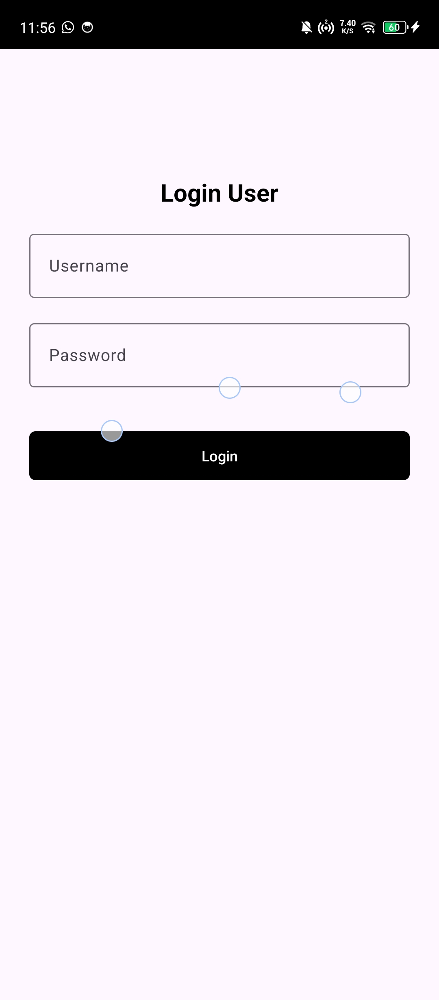
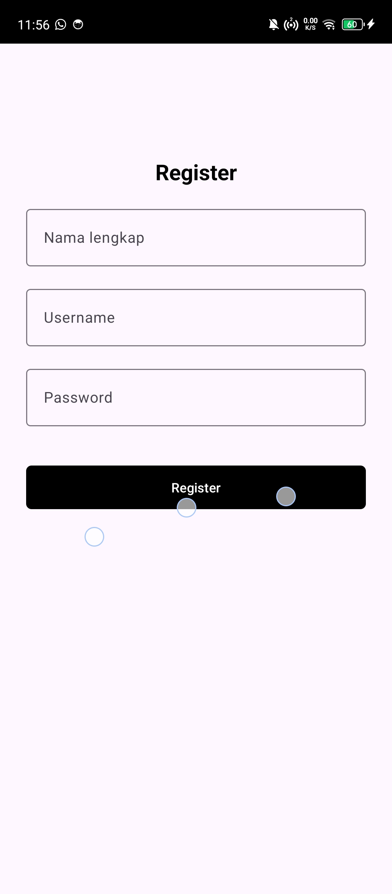
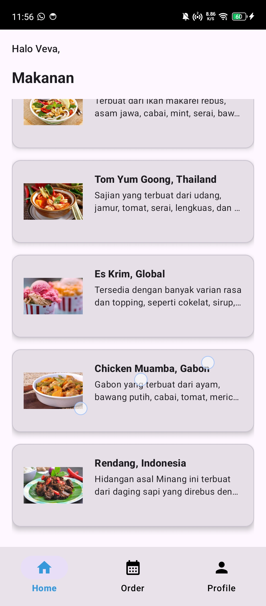
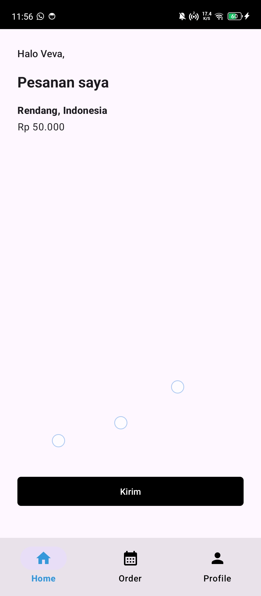
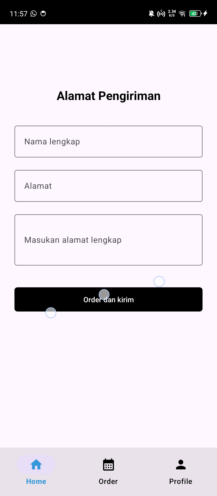
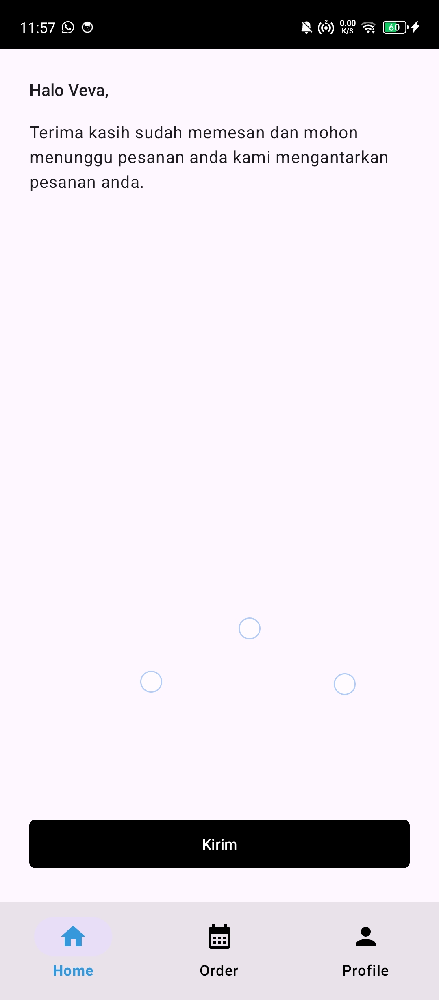

# Aplikasi "Mesen Makanan"

## 1. Arsitektur Inti: Dua Aktivitas, Banyak Fragment

Aplikasi ini dibangun menggunakan arsitektur Single-Activity yang dimodifikasi, membaginya menjadi dua "dunia" utama, masing-masing dengan Activity-nya sendiri:

AuthActivity (Dunia Otentikasi):
Berfungsi sebagai entry point (pintu masuk) aplikasi.
Tugas utamanya adalah menjadi "wadah" (FragmentContainerView) untuk alur otentikasi.
Semua navigasi di dalamnya (dari Welcome -> Signup -> Login/Register) diatur oleh auth_graph.xml.

MainActivity (Dunia Aplikasi Utama):
Ini adalah "wadah" untuk aplikasi inti setelah pengguna berhasil login.
Activity ini berisi BottomNavigationView (navbar bawah) dan FragmentContainerView untuk menampilkan konten utama.
Semua navigasi di dalamnya diatur oleh main_graph.xml.
Pemisahan ini merupakan praktik yang baik, karena alur otentikasi benar-benar terpisah dari alur aplikasi utama.

## 2. Alur Navigasi (Navigation Component)

Aplikasi ini sangat bergantung pada Android Navigation Component untuk mengelola semua perpindahan layar.

Alur Otentikasi (auth_graph.xml):
Pengguna mulai di WelcomeFragment.
Klik "Start" akan mengarahkan ke SignupFragment (action_welcomeFragment_to_signupFragment).
Dari SignupFragment, pengguna bisa memilih action_signupFragment_to_loginFragment atau action_signupFragment_to_registerFragment.

Alur Utama (main_graph.xml):
BottomNavigationView di MainActivity.kt terhubung ke NavController menggunakan NavigationUI.setupWithNavController().
Ini membuat klik pada ikon (Home, Order, Profile) secara otomatis mengganti fragment (homeFragment, orderHistoryFragment, profileFragment).
Terdapat juga alur "pesanan" yang lebih dalam:
Home -> OrderDetail -> Address -> ThankYou
Ini adalah navigasi nested (bersarang) yang dimulai dari homeFragment.

## 3. Logika Bisnis dan Validasi

Logic validasi penting telah diterapkan di tiga tempat:

LoginFragment.kt

RegisterFragment.kt

AddressFragment.kt

Di setiap fragment ini, terdapat pemeriksaan apakah EditText dalam keadaan isBlank(). Jika ya, error akan ditampilkan pada EditText tersebut dan navigasi dihentikan. Ini memastikan tidak ada data kosong yang dikirim dan alur aplikasi tetap kuat.

## 4. Desain dan Tema (Styling)

Tampilan dan nuansa (Look and Feel) aplikasi dikendalikan melalui:

Tema Tombol (themes.xml): Pengaturan colorPrimary ke @color/black secara otomatis membuat semua tombol standar menjadi hitam.

Status Bar (themes.xml): Status bar (bagian paling atas HP) diatur agar selalu berwarna hitam (android:statusBarColor) dengan teks putih (android:windowLightStatusBar diatur ke false).

Navbar Bawah (bottom_nav_color_selector.xml & activity_main.xml): Style kustom (@style/CustomBottomNav) dibuat khusus untuk navbar. Ini menggunakan color selector untuk mengubah warna ikon menjadi biru saat aktif/dicek dan hitam saat tidak aktif.

